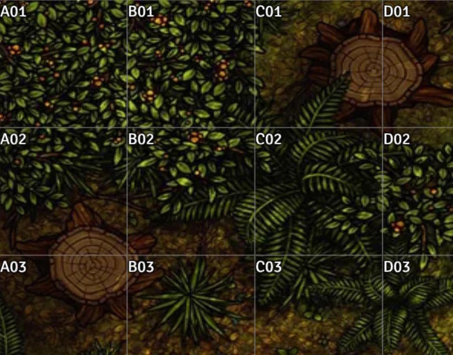
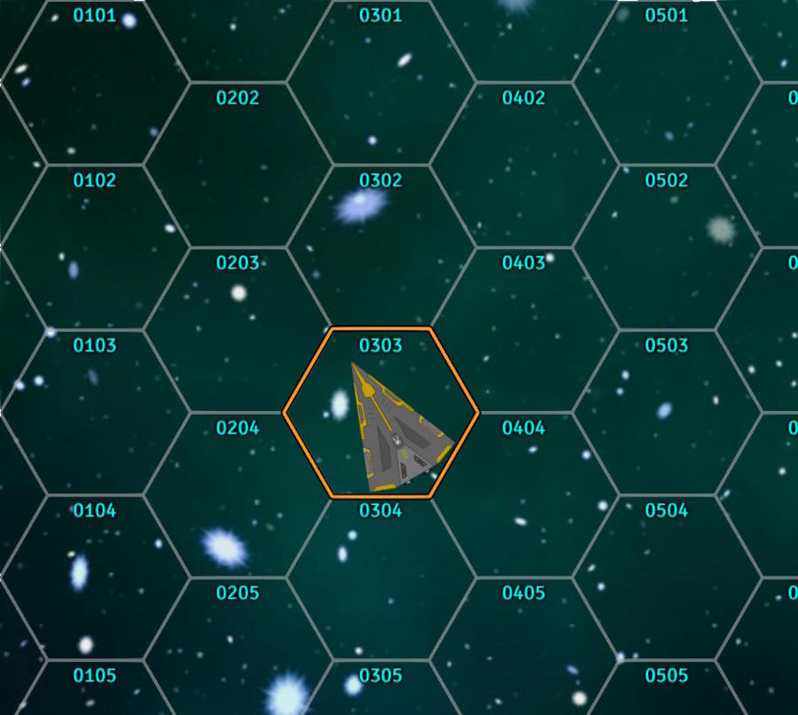

# Map Coordinates

> [!IMPORTANT]
> v1.0.0 release! This module is now feature complete. I might still add improvements, but everything is now present and working as far as I know 😀

- Add coordinates to any square or hex map.
- Set the numbering style - letters or numbers, font colour, and whether leading zeroes are used in the module settings.
- Alt-Click to "ping" your mouse location with its coordinates. The keybind is changeable in the module settings.
- Each scene remembers whether the coordinates are shown or hidden for that scene.
- Use the Measurement Controls menu with the World Map icon 🌐 to toggle between display modes.

## Gallery

| Feature | Preview |
| ------- | ------- |
| Toggle the coordinate display mode |  |
| Alternately display coordinates inside each grid cell |  |
| Adjustable font size, colour, and transparency for internal coordinates |  |
| Alt-click to *ping* the coordinates at the mouse location |  |
| Great for hex crawls! |  |
| Also great for sci-fi sector maps! |  |
